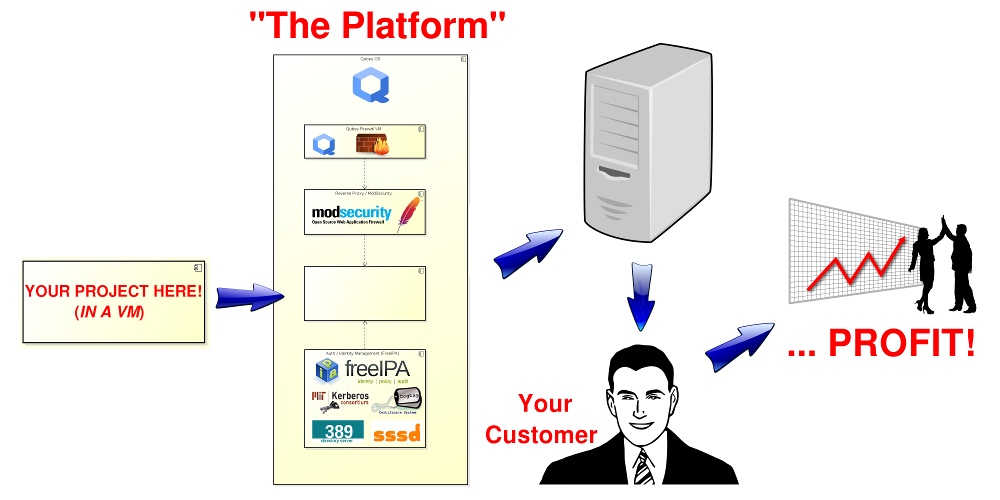

# The Platform Framework

## **_The platform for YOUR framework!_**

#### *Funny name,  Lofty goals.*

Wikipedia defines **Platform** (*[Computing Platform](https://en.wikipedia.org/wiki/Computing_platform)*) as...
> A computing platform is, in the most general sense, whatever a pre-existing piece of computer software or code object is designed to run within, obeying its constraints, and making use of its facilities.
>
>The term computing platform can refer to different abstraction levels, including a certain hardware architecture, an operating system (OS), and runtime libraries.[1] In total it can be said to be the stage on which computer programs can run.

Wikipedia defines **Framework** (*[Software Framework](https://en.wikipedia.org/wiki/Software_framework)*) as...
> In computer programming, a software framework is an abstraction in which software providing generic functionality can be selectively changed by additional user-written code, thus providing application-specific software.

<a name="toc"/>
## Table of Contents
* [What is The Platform Framework???](#whatisit)
* [Could you be a little more... specific?](#whatisitspecifically)
* [Project Goals / Guidelines](#goals)
* [Why the name *The Platform Framework*?](#whythename)
* [Why not Docker???](#whynotdocker)
* [Current project status](#status)
* [Project components (*Breakin' it Down*)](#components)
* [Who is "*we*"?](#whoiswe)
* [The mailing list](#mailinglist)
* [Who is *Joe Thielen*?](#joethielen)

<a name="whatisit"/>
## What is The Platform Framework???
This project was established to help provide a platform for software projects aimed at small- to medium-sized organizations/businesses. 

<a name="whatisitspecifically"/>
## Could you be a little more... specific?
Let's say you've got a [LAMP](https://en.wikipedia.org/wiki/LAMP_(software_bundle)) project and want to get it up and running at a business.  Maybe hardware isn't your thing.  Maybe you're a bit frightened by all the hacking going on.  This project aims to provide a platform for your project, using several specific technologies to help *armor* your project.   Additionally, the goal is to provide specifics on how, exactly, to get a server loaded with your project running on this platform into the hands of the target organization / business.  

Another way to put it is this project aims to provide you with what you need in order to turn *your* project into a [turn-key appliance](https://en.wikipedia.org/wiki/Computer_appliance).  

<a name="goals"/>
## Project Goals / Guidelines
* The target is primarily small- to medium-sized businesses.
  * Enterprise already has a wealth of solutions involving multiple servers, data centers, cloud technologies, etc..
* Emphasis on security and automation.
  * Both of these should be involved in every step of the project, top to bottom and start to finish.
* No *cloud* needed! The entire system is local, on-premesis.
  * In some cases, the organization / business may not wish to, or may even be required to not, have their data *in the cloud*...
  * The project is not necessarily *anti-cloud*, it simply recognizes the need (or want) for some organizations / businesses to keep their data local.
* Easy of use - *for the organization/business*.
  * Businesses, *small or large*, are cheap **AND** lazy! 
    * Common themes (*the project in no way endorses these behaviors, it simply recognizes they exist*): 
      * The bottom-line is king (**$$$**). 
      * Maintenance is deferred. 
      * No such thing as corporate ethics. 
    * The goal is to *recognize these factors and adapt...*
  * No/Low maintenance - should not need constant IT oversight.  **_AUTOMATION!_**
* Can we get the whole system to run on one machine?
  * Redundant/replication servers are another goal.
  * Development environment server.

<a name="whythename"/>
## Why the name *The Platform Framework*?

The original project creator found it childishly amusing.  And the domain name was available...

If you think about it, after reading through all the information on this page, it really is a *framework* for creating *platforms*.  If you turn it around, it could also be said this project creates the *platform* for **your** *framework*.  You are not forced in your project to use a particular framework, or even use one at all.

It's better said that you're free to use whatever framework you want, or not... the choice is yours.

<a name="whynotdocker"/>
## Why not Docker???

That's a great question.  Docker currently has some known issues where it comes to completely isolating containers from each other, from a security context.  These are outlined [here](https://www.oreilly.com/ideas/five-security-concerns-when-using-docker).    Containers are not truly contained... in theory "container breakout" is possible.  With VMs when using technologies like [VT-x/AMD-V](https://en.wikipedia.org/wiki/X86_virtualization#Intel_virtualization_.28VT-x.29) & [VT-d/IOMMU](https://en.wikipedia.org/wiki/X86_virtualization#Intel-VT-d) this is **far less** of a possibility for VMs.  Not to say it'd be impossible, but certainly harder.

While Docker sure is neat, and it's future looks bright, due to those issues it's not something we can currently make use of.  That's not to say it can't or won't be looked at again in the future...

Another reason we're currently not looking into Docker is there are already a lot of existing options out there for those who care to *containerize* their apps.

However, if your project is already containerized, it may be possible to use Docker within the system to run your project.  Since your project will be running in it's own VM (of your creation), you are free to load up your VM with Docker, and run your project from that.  Whether that's feasible or not has yet to be established. But we're not currently looking at Docker as a key/major technology within our project.

<a name="status"/>
## Current project status

The project is newly created (August 2016).  The current focus is on researching and evaluating the major technologies to be used.

<a name="components"/>
## Project components (*Breakin' it Down*)

The philosophy is to comparment things from each other.  Keep things modular, on a system-level.  

* The goal is to have one server, in order to keep costs down.
* That one server will run some type of virtualization software / hypervisor.
  * Currently we're looking at [Qubes](http://www.qubes-os.org).  They Qubes people are pretty smart and have a good reputation for security.  There are some pretty neat concepts within Qubes that we feel can be harnessed.
    * *But Qubes is a **desktop OS**!*  I know.  And one of the Qubes project leads, Joanna Rutkowska, has even [publically stated](https://groups.google.com/d/msg/qubes-devel/BSP16ZYmSmA/bhAjZZOGai4J) it wouldn't make sense to use Qubes for a server, instead just use *Xen* (the underlying hypervisor for Qubes).  At this point we're disagreeing and thinking there could be something to this, but at this point it's just a concept and has yet to be proven...
* Your app will hide behind not one, but two VMs...
  * First is the Qubes Firewall VM.
  * Second is the project's reverse proxy VM, possibly making use of [ModSecurity](https://www.modsecurity.org/) to provide a *Web Application Firewall (WAF)*.  This will potentionally help reduce malicious traffic.
* The project will also provide auth services and *Identity Management (IdM)*.  We're currently looking at the [FreeIPA](https://www.freeipa.org) project software for this purpose.
  * This will run in it's own VM as well.
  * This means that if you've not written your app yet, or are willing to modify it (perhaps significantly), then auth and user management parts are *already done* for you...!
    * This also potentially (assuming FreeIPA) includes some really neat features like *Kerberos* and *LDAP*...
* As time goes on there will be more features, and certainly more VMs...

So, the question becomes, can one machine run all this, **and** be affordable to small- and medium-sized organizations / businesses?  We're not entirely sure just yet.  But we're going to find out... 

<a name="whoiswe"/>
## Who is "*we*"?

Well, um, currently, it's just me, Joe Thielen, project creator.  But I'm hoping in time the project will grow and be joined by other individuals who share similar beliefs in the project goals / guidelines.

Please, *feel free* to drop a line on the [Mailing List](http://www.freelists.org/list/theplatformframework)!  I've created this project on GitHub specifically to help attract attention and make the project larger than myself.

<a name="mailinglist"/>
## The mailing list

**Mailing list page:** [http://www.freelists.org/list/theplatformframework]

**How to subscribe to the mailing list:**
* Option 1: Send an e-mail to [theplatformframework-request@freelists.org](mailto:theplatformframework-request@freelists.org?subject=subscribe) with 'subscribe' in the Subject field.
* Option 2: Visit the [mailing list page](http://www.freelists.org/list/theplatformframework)
  * Enter your e-mail address in the *User Options: Your email address* field.
  * In the *Choose an action:* drop-down choose *Subscribe* and press the *Go!* button.

** How to send an e-mail to the mailing list (_after you've subscribed_):**
Send an e-mail to [theplatformframework@freelists.org](mailto:theplatformframework@freelists.org)

**How to search the mailing list archive:**
There is also a search page available at: [http://www.freelists.org/archive/theplatformframework]

**How to unsubscribe from the mailing list:**
* Option 1: Send an e-mail to [theplatformframework-request@freelists.org](mailto:theplatformframework-request@freelists.org?subject=unsubscribe) with 'unsubscribe' in the Subject field.
* Option 2: Visit the [mailing list page](http://www.freelists.org/list/theplatformframework)
  * Enter your e-mail address in the *User Options: Your email address* field.
  * In the *Choose an action:* drop-down choose *Unsubscribe* and press the *Go!* button.

<a name="joethielen"/>
## Who is *Joe Thielen*?

I've been creating fairly complex monolithic LAMP apps for both non- and for-profit companies for over 20 years.  My experience lies with small- and medium- sized organizations / businesses in the USA.  I no longer wish to keep making apps which are *monolithic*.  That's the basic genesis for this project.

View my [LinkedIn Profile](https://www.linkedin.com/in/joethielen) for more professional (*or lack thereof*) information.
